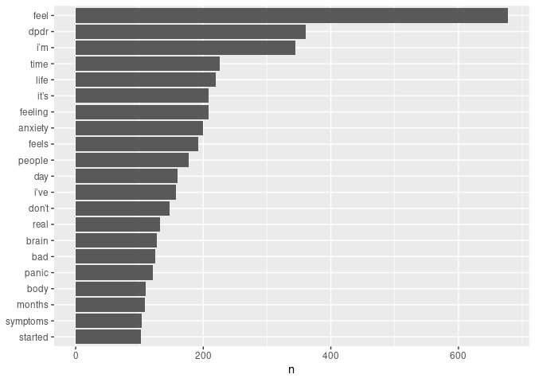
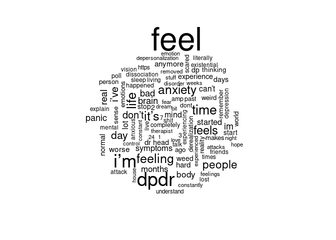
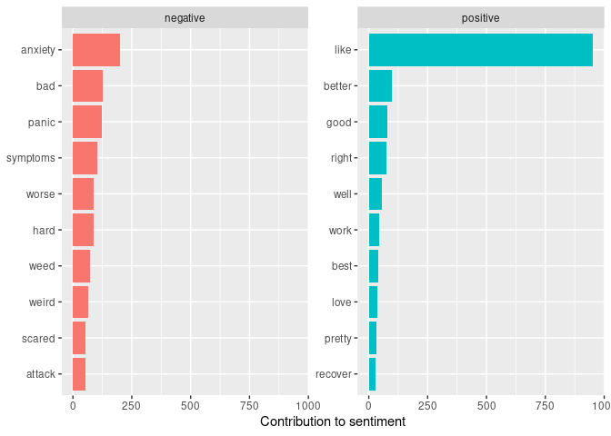
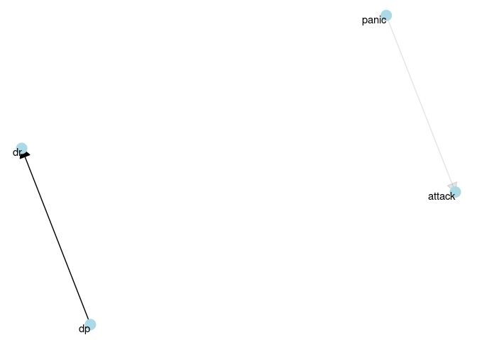
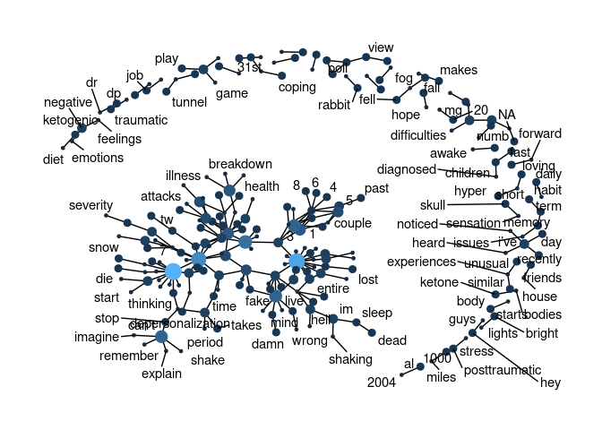

# Exploratory Analysis of r/dpdr with R

> 2022-03-25

## Description of raw data:

-   Webscraped using PRAW, Reddit’s API
-   From forum about depersonalization/derealization.
-   Contains post title, post content, post date
-   Data date range: 2022-03-01 to 2022-03-27

## Most commonly used words:

<!-- --><!-- -->

## Most common positive and negative words:

<!-- -->

## Relationships between words: n-grams and correlations

### Visualizing a network of bigrams:

<!-- -->

## Centrality of Words

<!-- -->

---