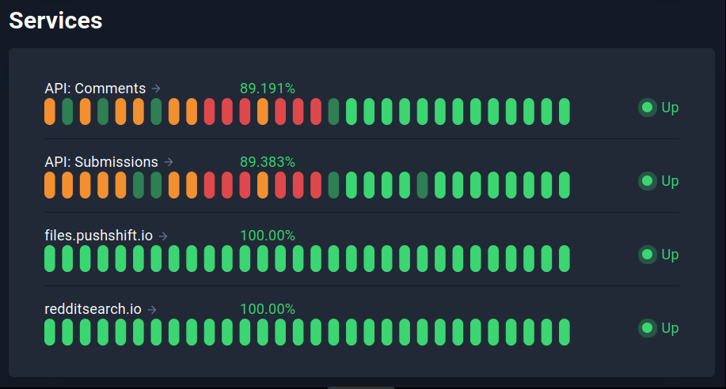

# Web-Scraping Reddit

A popular and easy way to retrieve data from Reddit is through the [**PushShift.io**](https://reddit-api.readthedocs.io/en/latest/) API Wrapper [**PMAW**](https://github.com/mattpodolak/pmaw), [**PSAW**](https://psaw.readthedocs.io/en/latest/), or [**PRAW**](https://praw.readthedocs.io/en/stable/). Unfortunately, many attempts at using them produced questionable results - submissions were missing within specified timeframes, as well as producing numerous duplicates of ones that were retrieved. The former has been confirmed by Elizaveta Sivak's article within the Summer Institute in Computational Social Science website, as seen [**here**](https://sicss.io/2021/materials/hse/reddit_.html). These wrappers do not have access to posts in certain timeframes.

As a result, the more manual use of files.PushShift.io itself is utilized, due to its 100% operational status as seen [here](https://stats.uptimerobot.com/l8RZDu1gBG). Screenshot taken on Jan 17, 2023:

<p align="center">
  
</p>

Description of web-scraped data:
1. 2019-11 to 2021-02

The following scripts were used:
1. A python script that automates the downloading of files from [files.pushshift.io](https://files.pushshift.io/reddit/submissions/):

``` python
from tqdm import tqdm
import urllib.request
import os
dates = ['2019-11', '2019-12', '2020-01', ..., '2022-12']

for i, date in enumerate(dates):
    file_url = f'https://files.pushshift.io/reddit/submissions/RS_{date}.zst'
    file_name = f'Datasets/RS_{date}.zst'

    if not os.path.exists(file_name):
        with tqdm(unit='MB', unit_scale=True, unit_divisor=1024, miniters=1,
                  desc=f'{i+1}/{len(dates)}: {file_name}', leave=True) as t:
            def reporthook(blocknum, blocksize, totalsize):
                readsofar = blocknum * blocksize
                if totalsize > 0:
                    percent = readsofar * 1e2 / totalsize
                    s = "\r%5.1f%% %*d / %d" % (
                        percent, len(str(totalsize)), readsofar/1000000, totalsize/1000000)
                    t.set_description(s)
            urllib.request.urlretrieve(file_url, file_name, reporthook=reporthook)
    else:
        print(f"{file_name} already exists.")
```

1. PushshiftDumps by Watchful1
  - [combine_folder_multiprocess.py](https://github.com/Watchful1/PushshiftDumps/blob/master/scripts/combine_folder_multiprocess.py)
  - [single_file.py (adapted)]()

2. 
# Web-Scraping Facebook ?

asdf
----
