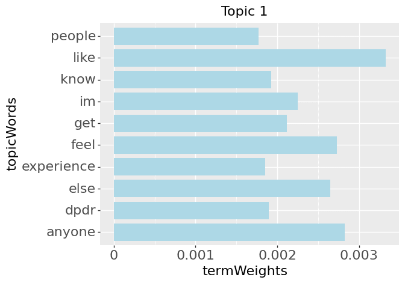
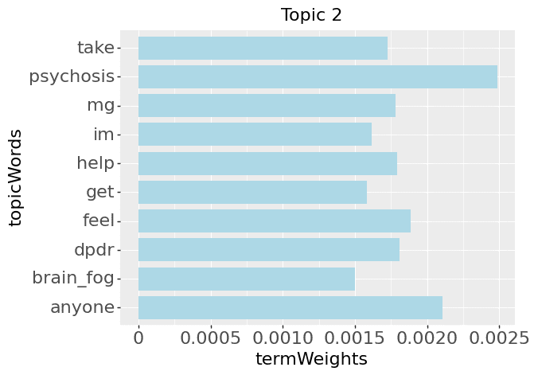
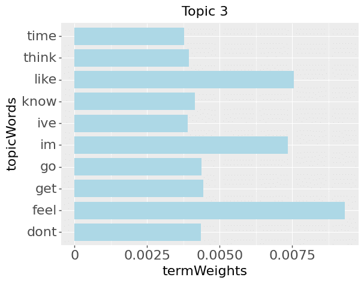
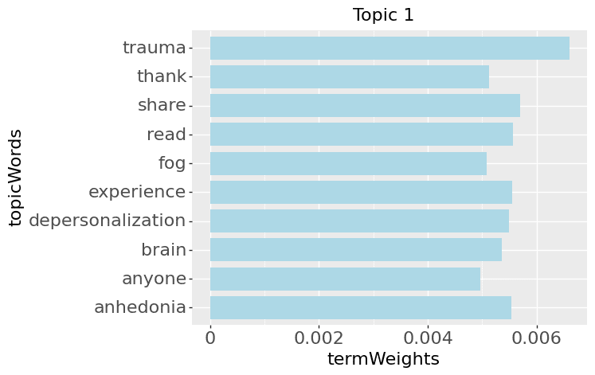
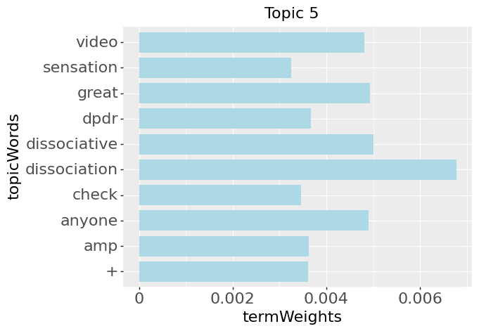
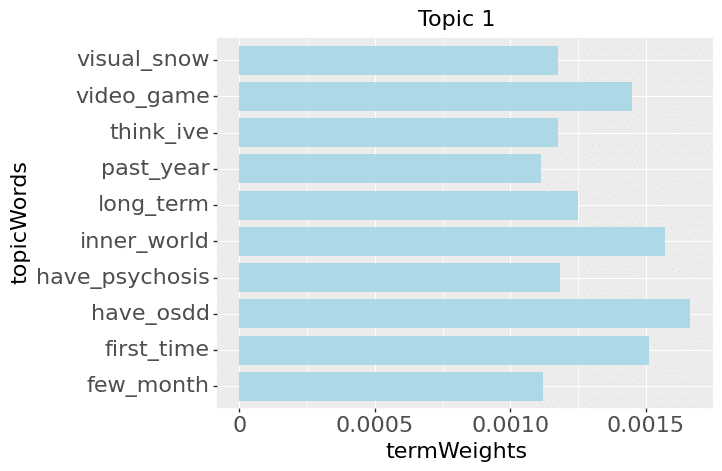
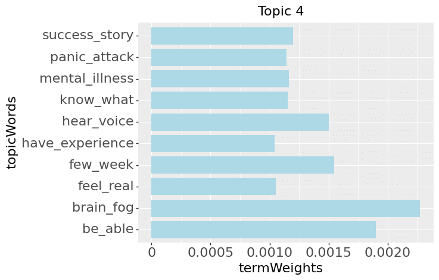

# Topic Modeling with TF-IDF and LDA
> Large segments of code were adapted from Obedkova's (2020) tutorial, namely in the following sections: SparkNLP Pipelines, PoS-based Filtering, and Vectorization.

## Datasets

1. **Dissociation**: dpdr, dpdrhelp, Dissociation, Depersonalization, derealization, DPDRecoveryStories, OSDD, anhedonia, BrainFog, Psychosis. 
  - Date range: 2019-11 to 2022-04
2. **dpdr**
  - Date range: 2022-12 to 2023-01

Here is a glimpse of the dataset:
<!-- -->

## SparkNLP Pipelines
### No.1: Unigrams & PoS
First, a basic pipeline is used to transform the dataset **Dissociation** into unigrams and their respective Parts of Speech (PoS) labels. N-grams are also found, but may contain questionable combinations; this output will be further processed in the next pipeline.

This pipeline uses the following annotators:
1. **Document Assembler**: Prepares data into a format that is processable by Spark NLP. This is the entry point for every Spark NLP pipeline. (*Input*: the 'post' column in the current dataset.)
2. **Tokenizer**: Tokenizes raw text into word pieces, tokens. Identifies tokens with tokenization open standards. A few rules will help customizing it if defaults do not fit user needs.
3. **Normalizer**: Removes all dirty characters from text following a regex pattern and transforms words based on a provided dictionary.
4. **Stop Words Cleaner**: Takes a sequence of strings (e.g. the output of a Tokenizer, Normalizer, Lemmatizer, etc.) and drops all the stop words from the input sequences.
5. **NGram Generator**: Converts the input array of strings (annotatorType TOKEN) into an array of n-grams (annotatorType CHUNK).
6. **POSTagger**: Averaged Perceptron model to tag words part-of-speech.
7. **Finisher**: Converts annotation results into a format that easier to use. It is useful to extract the results from Spark NLP Pipelines.
> Definitions taken from the official SparkNLP website (John Snow Labs, 2021).

Contrary to commonly used NLP pipelines, a Lemmatizer Annotator is not used, in order to preserve the various uses of verb tenses. This affects generated n-grams. 

Output:
<!-- -->

### No.2: N-Grams
PoS-based filtering is used in this pipeline to remove strange word combinations and reduce vocab size.

The following pipeline is used to correspond PoS tag n-grams with word n-grams:
1. Document Assembler (*Input*: the 'finished_pos' column from the above output.)
2. Tokenizer
3. NGram Generator
4. Finisher

## PoS-based Filtering
Unigrams:
<!-- -->

Bigrams and Trigrams:
<!-- -->

## Vectorization: TF-IDF
Unigram and n-gram data as shown above are first combined. Then, **TF** (term frequency) vectorization is performed with **CountVectorizer** in PySpark. Finally, **IDF**(inverse document frequency) is used to lower word frequency scores.

## Unsupervised Topic Modeling with LDA (Latent Dirichlet Allocation)
> LDA (Blei et al., 2003) is one of the most popular topic modeling methods. Each document is made up of various words, and each topic also has various words belonging to it. The aim of LDA is to find topics a document belongs to, based on the words in it.

*Direct quotation from Kulshrestha (2020)*

When performing LDA, the number of topics is fixed and predetermined. To find the optimal number of topics, LDA models with x number of topics are trained and their corresponding logLikelihood and logPerplexity calculated. This is an expensive operation to run, in terms of time and computing resources, so dataset **dpdr** was used here. 

 | 

Thus, it seems that an eye estimated optimal number of topics is NumTopic = 5.

Given that the LDA algorithm is probabilistic in nature, the following two parameters will be set for further topic modeling:
1. Max iterations = 200.

The previous LDA was set to maxIter = 10. Increasing the number of iterations can help improve result stability, at the cost of increased computational resources.

2. Seed = 123

LDA relies on a random number generator for initialization, and using a seed can help ensure consistency across multiple runs.

## Topics based on Unigrams & N-Grams

 | 
 | 
 | 

## Topics based on Unigrams

 | 
 | 
 | 

## Topics based on N-Grams

 | 
 | 
 | 

## References:
Obedkova, M. (2020, May). Topic Modelling with PySpark and Spark NLP. GitHub. Retrieved January 17, 2023, from https://github.com/maobedkova/TopicModelling_PySpark_SparkNLP 

Blei, D., Ng, A. Y., &amp; Jordan, M. I. (2003). Latent Dirichlet Allocation. Journal of Machine Learning, 3, 993–1022. https://doi.org/10.5555/944919.944937 

John Snow Labs. (2021, April 17). Annotators. High Performance NLP with Apache Spark. Retrieved January 17, 2023, from https://nlp.johnsnowlabs.com/docs/en/annotators 

Kulshrestha, R. (2020, September 28). Latent dirichlet allocation. Medium. Retrieved January 17, 2023, from https://towardsdatascience.com/latent-dirichlet-allocation-lda-9d1cd064ffa2 

---