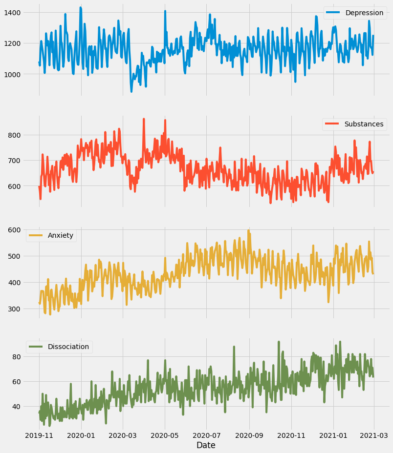
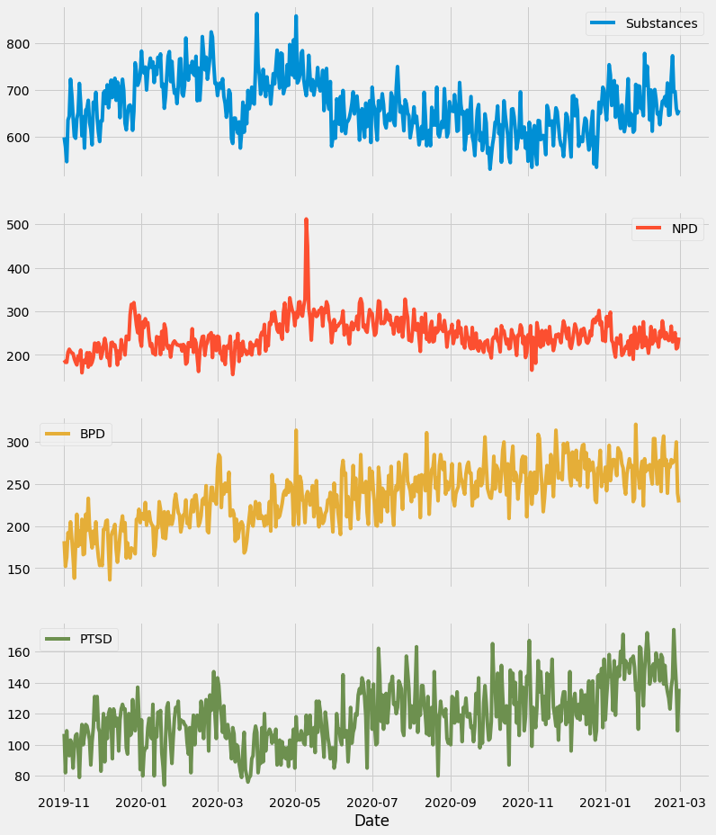

# To do:
1. Extend the date range, ending at 2022-11. 
2. Add more groups to the comparisons.
3. Organize the graphs into one single interactive plot, where specific groups can be toggled on or off.
4. Write about the differences in trends between the different groups, in relation to COVID waves.
5. Include hyperlinks to the subreddits within each group, within group descriptions, and provide a brief summary of the purpose of each group

# Group descriptions:
1. **Anxiety**: Anxiety, Anxietyhelp, socialanxiety, HealthAnxiety, anxietysuccess
2. **BPD** (Borderline Personality Disorder): BPD, BPDlovedones, BorderlinePDisorder, BPD4BPD, BPDParterns
3. **Depression**: SuicideWatch, depression, depression_help
4. **Dissociation**: dpdr, dpdrhelp, Dissociation, Depersonalization, derealization, DPDRecoveryStories, OSDD, anhedonia, BrainFog
5. **NPD** (Narcissistic Personality Disorder): NarcissisticAbuse, raisedbynarcissists
6. **PTSD**: CPTSD, PTSD, Ptsdrecovery
7. **Substances**: addiction, benzorecovery, Drugs, HPPD, leaves, opiates, Psychonaut, REDDITORSINRECOVERY, zoloft

<!-- -->

<!-- -->

---