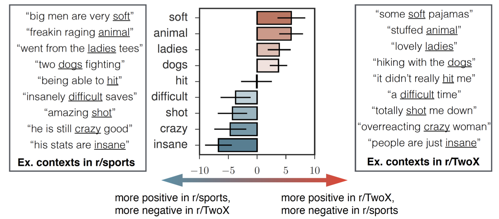

# What is sentiment analysis?

When humans read documents, we are able to infer the emotional valence behind words and phrases. It can be a generally negative or positive sentiment, such as: "I'm having a terrible day" or "My day was fantastic". More complex emotions can also be understood, i.e., surprise: "Oh wow!". According to Silge and Robinson (2017), sentiment analysis allows one to programmatically analyse emotional sentiments within large amounts of text, quickly and without manual input or supervision. In qualitative quantitative mixed methods studies, the application of this approach within the qualitative side may prove invaluable and significantly reduce time and resources spent. 

When sentiment analysis is performed, a lexicon is used to compare and assign emotional sentiment to the text. Three general purpose lexicons are [AFINN](http://www2.imm.dtu.dk/pubdb/views/publication_details.php?id=6010), [bing](https://www.cs.uic.edu/~liub/FBS/sentiment-analysis.html), and [nrc](http://saifmohammad.com/WebPages/NRC-Emotion-Lexicon.htm). However, according to Hamilton et al. (2016), the emotional sentiment of words or phrases often varies according to the domain or context. The following figure, borrowed from their article, illustrates this:

<!-- -->
*Figure 1*. Word sentiment differences between a sports subreddit and a subreddit dedicated to female perspectives and struggles (Hamilton et al. 2016).
# Proposed Research Questions

1. Is there a significant difference between subreddit group specific lexicons?

2. Do the most common positive and negative words differ between each group, i.e. Dissociation, Depression, and Substance Use?

3. Among these groups, are there differences in the most common bi-grams (two word phrases) starting with the same word, such as "like" or "feel"?

# Description of groups of subreddits
1. **Anxiety**: Anxiety, Anxietyhelp, socialanxiety, HealthAnxiety, anxietysuccess
2. **BPD** (Borderline Personality Disorder): BPD, BPDlovedones, BorderlinePDisorder, BPD4BPD, BPDParterns
3. **Depression**: SuicideWatch, depression, depression_help
4. **Dissociation**: dpdr, dpdrhelp, Dissociation, Depersonalization, derealization, DPDRecoveryStories, OSDD, anhedonia, BrainFog
5. **NPD** (Narcissistic Personality Disorder): NarcissisticAbuse, raisedbynarcissists
6. **PTSD**: CPTSD, PTSD, Ptsdrecovery
7. **Substances**: addiction, benzorecovery, Drugs, HPPD, leaves, opiates, Psychonaut, REDDITORSINRECOVERY, zoloft

# To do

End product:
1. Bar charts showing top most common positive and negative words in a subreddit, words associated with a specific word, i.e. like, feel, not, with x axis as sentiment value.
2. Charts specific to each subreddit.
3. Charts comparing the use of similar words used in different subreddits.
4. Compare sentiment lexicons/dictionaries, domain specific vs AFINN vs bing vs NRC.

Steps:
1. Figure out and adapt [socialsent code](https://github.com/williamleif/socialsent) example.
2. Create domain specific sentiment lexicons/dictionaries for each subreddit group.
3. Perform sentiment analysis - looking at units beyond just words, sentiment of sentence.
4. Visualize sentiment analysis output with plotnine

# References
Hamilton, W. L., Clark, K., Leskovec, J., &amp; Jurafsky, D. (2016). Inducing domain-specific sentiment lexicons from unlabeled corpora. arXiv.org. Retrieved February 13, 2023, from https://arxiv.org/abs/1606.02820 

Silge, J., &amp; Robinson, D. (2017). Text mining with R: A tidy approach. O'Reilly. 
---