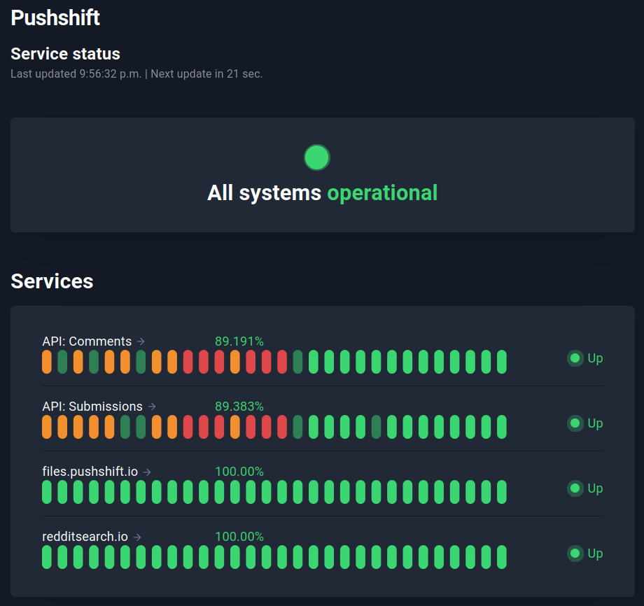

# Web-Scraping Reddit

A popular and easy way to retrieve data from Reddit is through the [**PushShift.io**](https://reddit-api.readthedocs.io/en/latest/) API Wrapper [**PMAW**](https://github.com/mattpodolak/pmaw), [**PSAW**](https://psaw.readthedocs.io/en/latest/), or [**PRAW**](https://praw.readthedocs.io/en/stable/). Unfortunately, many attempts at using them produced questionable results - many post submissions were missing within specified timeframes, as well as producing numerous duplicates of ones that were retrieved. The former has been confirmed by Elizaveta Sivak's article within the Summer Institute in Computational Social Science website, as seen [**here**](https://sicss.io/2021/materials/hse/reddit_.html). These wrappers do not have access to posts in certain timeframes.

As a result, the more manual use of PushShift.io itself is utilized, due to its 100% operational status as seen [here](https://stats.uptimerobot.com/l8RZDu1gBG). Screenshot taken on Jan 17, 2023:

  

However, there are still some limitations:
1. Reddit's PushShift.io fundamentally limits each post retrieval amount to 1000.
2. There was some difficulty in troubleshooting the use of specific timeframes, i.e., between date1 to date2. 

Thus, temporarily for now, the current dataset is described as the following:
- n = 1000 post submissions from r/DPDR
- sorted by submission date in descending order, starting from January 15, 2023

# Web-Scraping Facebook ?

asdf
----
